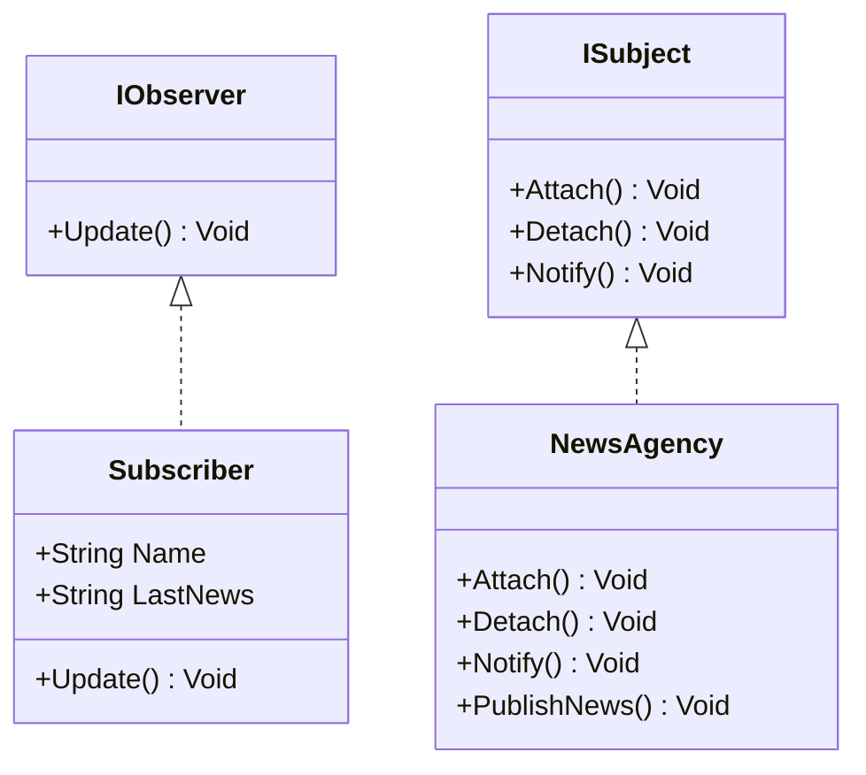

# PATRÓN OBSERVER - DISEÑO DE COMPORTAMIENTO




---

## OBJETIVO
Implementar el patrón **Observer** (Observador), donde uno o varios observadores se suscriben a un sujeto para recibir notificaciones automáticas cuando cambia su estado.

---

## PASO A PASO (para copiar y pegar)

### 1. Crear la solución y los proyectos
```bash
dotnet new sln -o Comportamiento
cd Comportamiento
dotnet new classlib -o Comportamiento.Domain
dotnet sln add ./Comportamiento.Domain/Comportamiento.Domain.csproj

dotnet new nunit -o Comportamiento.Domain.Tests
dotnet sln add ./Comportamiento.Domain.Tests/Comportamiento.Domain.Tests.csproj
dotnet add ./Comportamiento.Domain.Tests/Comportamiento.Domain.Tests.csproj reference ./Comportamiento.Domain/Comportamiento.Domain.csproj
```

> Abre la carpeta `Comportamiento` con Visual Studio Code (o tu IDE preferido).

### 2. Implementar las interfaces y clases (proyecto `Comportamiento.Domain`)

**IObserver.cs**
```csharp
namespace Comportamiento.Domain
{
    // Interfaz para los observadores
    public interface IObserver
    {
        void Update(string message);
    }
}
```

**ISubject.cs**
```csharp
using System.Collections.Generic;

namespace Comportamiento.Domain
{
    // Interfaz para el sujeto (Observable)
    public interface ISubject
    {
        void Attach(IObserver observer);
        void Detach(IObserver observer);
        void Notify(string message);
    }
}
```

**NewsAgency.cs (Sujeto concreto)**
```csharp
using System;
using System.Collections.Generic;

namespace Comportamiento.Domain
{
    public class NewsAgency : ISubject
    {
        private List<IObserver> _observers = new List<IObserver>();

        public void Attach(IObserver observer)
        {
            _observers.Add(observer);
        }

        public void Detach(IObserver observer)
        {
            _observers.Remove(observer);
        }

        public void Notify(string message)
        {
            foreach (var observer in _observers)
            {
                observer.Update(message);
            }
        }

        public void PublishNews(string news)
        {
            Console.WriteLine($"[NewsAgency] Nueva noticia publicada: {news}");
            Notify(news);
        }
    }
}
```

**Subscriber.cs (Observador concreto)**
```csharp
using System;

namespace Comportamiento.Domain
{
    public class Subscriber : IObserver
    {
        public string Name { get; }
        public string LastNews { get; private set; } = string.Empty;

        public Subscriber(string name)
        {
            Name = name;
        }

        public void Update(string message)
        {
            LastNews = message;
            Console.WriteLine($"[{Name}] recibió noticia: {message}");
        }
    }
}
```

### 3. Pruebas unitarias (proyecto `Comportamiento.Domain.Tests`)

**NewsAgencyTests.cs**
```csharp
using NUnit.Framework;
using Comportamiento.Domain;

namespace Comportamiento.Domain.Tests
{
    public class NewsAgencyTests
    {
        [Test]
        public void GivenSubscribers_WhenNewsPublished_AllReceiveNotification()
        {
            var agency = new NewsAgency();
            var subscriber1 = new Subscriber("Camila");
            var subscriber2 = new Subscriber("Bianca");

            agency.Attach(subscriber1);
            agency.Attach(subscriber2);

            agency.PublishNews("Nueva conferencia de software anunciada.");

            Assert.AreEqual("Nueva conferencia de software anunciada.", subscriber1.LastNews);
            Assert.AreEqual("Nueva conferencia de software anunciada.", subscriber2.LastNews);
        }

        [Test]
        public void GivenUnsubscribedUser_WhenNewsPublished_DoesNotReceiveNotification()
        {
            var agency = new NewsAgency();
            var subscriber = new Subscriber("Luis");

            agency.Attach(subscriber);
            agency.Detach(subscriber);

            agency.PublishNews("Nueva actualización de .NET 9!");

            Assert.AreEqual(string.Empty, subscriber.LastNews);
        }
    }
}
```

### 4. Ejecutar pruebas
```bash
dotnet test --collect:"XPlat Code Coverage"
```

Esperado:
```
Passed!  - Failed: 0, Passed: 2, Skipped: 0, Total: 2
```

### 5. Generar diagrama de clases (opcional)
> Si quieres generar el diagrama usando `dll2mmd`, instala la herramienta y ajusta la ruta a la versión de .NET que uses.

```bash
dotnet tool install --global dll2mmd
# Ajusta la ruta netX.X según la versión de .NET que tengas (por ejemplo net8.0 o net7.0)
dll2mmd -f Comportamiento.Domain/bin/Debug/net8.0/Comportamiento.Domain.dll -o comportamiento.md
```
