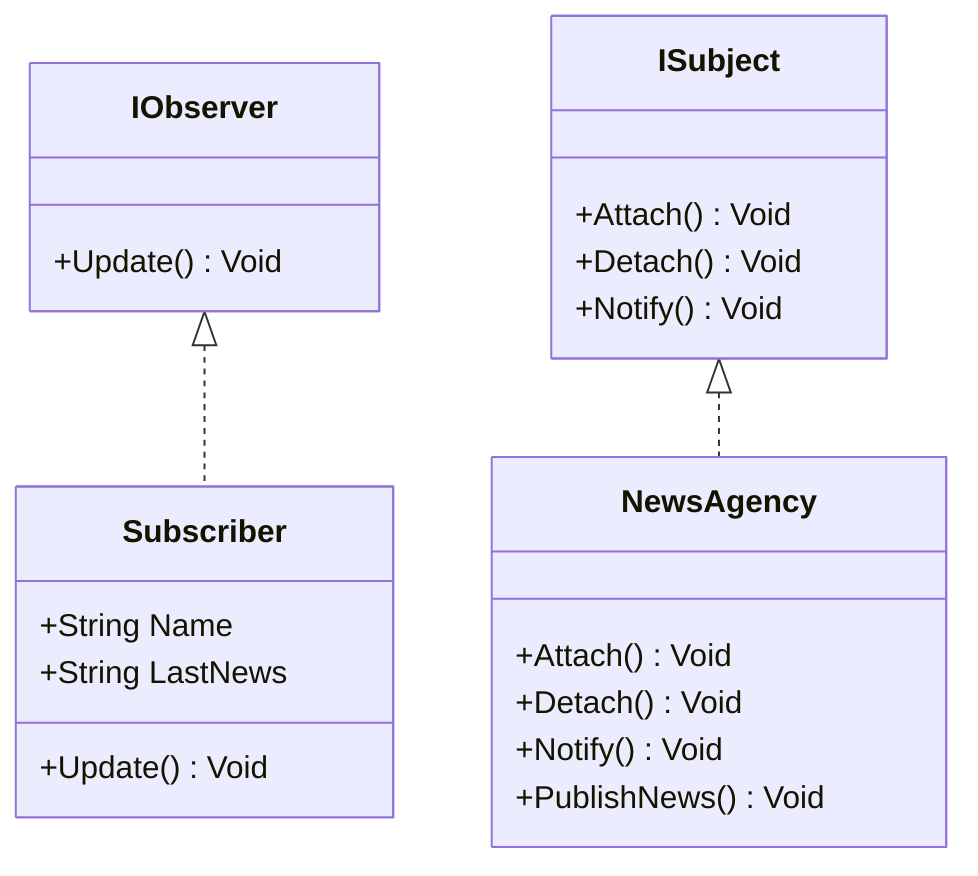

```mermaid.md
classDiagram

class IObserver
IObserver : +Update() Void

class ISubject
ISubject : +Attach() Void
ISubject : +Detach() Void
ISubject : +Notify() Void

class NewsAgency
NewsAgency : +Attach() Void
NewsAgency : +Detach() Void
NewsAgency : +Notify() Void
NewsAgency : +PublishNews() Void

class Subscriber
Subscriber : +String Name
Subscriber : +String LastNews
Subscriber : +Update() Void


ISubject <|.. NewsAgency
IObserver <|.. Subscriber

```
